```mermaid
flowchart TB
    subgraph upstream["Dependants (1)"]
        P4["<b>📦&nbsp;WindowLoggerTray.csproj</b><br/><small>net10.0-windows</small>"]
        click P4 "#windowloggertraywindowloggertraycsproj"
    end
    subgraph current["WindowAnalyser.csproj"]
        MAIN["<b>📦&nbsp;WindowAnalyser.csproj</b><br/><small>net10.0</small>"]
        click MAIN "#windowanalyserwindowanalysercsproj"
    end
    P4 --> MAIN

```

```mermaid
flowchart TB
    subgraph upstream["Dependants (1)"]
        P4["<b>📦&nbsp;WindowLoggerTray.csproj</b><br/><small>net10.0-windows</small>"]
        click P4 "#windowloggertraywindowloggertraycsproj"
    end
    subgraph current["WindowLogger.csproj"]
        MAIN["<b>📦&nbsp;WindowLogger.csproj</b><br/><small>net10.0</small>"]
        click MAIN "#windowloggerwindowloggercsproj"
    end
    P4 --> MAIN

```

```mermaid
flowchart TB
    subgraph upstream["Dependants (1)"]
        P4["<b>📦&nbsp;WindowLoggerTray.csproj</b><br/><small>net10.0-windows</small>"]
        click P4 "#windowloggertraywindowloggertraycsproj"
    end
    subgraph current["WindowLoggerConfigGui.csproj"]
        MAIN["<b>📦&nbsp;WindowLoggerConfigGui.csproj</b><br/><small>net48</small>"]
        click MAIN "#windowloggerconfigguiwindowloggerconfigguicsproj"
    end
    P4 --> MAIN

```

```mermaid
flowchart TB
    subgraph current["WindowLoggerTray.csproj"]
        MAIN["<b>📦&nbsp;WindowLoggerTray.csproj</b><br/><small>net10.0-windows</small>"]
        click MAIN "#windowloggertraywindowloggertraycsproj"
    end
    subgraph downstream["Dependencies (3"]
        P3["<b>📦&nbsp;WindowLoggerConfigGui.csproj</b><br/><small>net48</small>"]
        P2["<b>📦&nbsp;WindowAnalyser.csproj</b><br/><small>net10.0</small>"]
        P1["<b>📦&nbsp;WindowLogger.csproj</b><br/><small>net10.0</small>"]
        click P3 "#windowloggerconfigguiwindowloggerconfigguicsproj"
        click P2 "#windowanalyserwindowanalysercsproj"
        click P1 "#windowloggerwindowloggercsproj"
    end
    MAIN --> P3
    MAIN --> P2
    MAIN --> P1

```

# Projects and dependencies analysis

This document provides a comprehensive overview of the projects and their dependencies in the context of upgrading to .NETCoreApp,Version=v10.0.

## Table of Contents

- [Executive Summary](#executive-Summary)
  - [Highlevel Metrics](#highlevel-metrics)
  - [Projects Compatibility](#projects-compatibility)
  - [Package Compatibility](#package-compatibility)
  - [API Compatibility](#api-compatibility)
- [Aggregate NuGet packages details](#aggregate-nuget-packages-details)
- [Top API Migration Challenges](#top-api-migration-challenges)
  - [Technologies and Features](#technologies-and-features)
  - [Most Frequent API Issues](#most-frequent-api-issues)
- [Projects Relationship Graph](#projects-relationship-graph)
- [Project Details](#project-details)

  - [WindowAnalyser\WindowAnalyser.csproj](#windowanalyserwindowanalysercsproj)
  - [WindowLogger\WindowLogger.csproj](#windowloggerwindowloggercsproj)
  - [WindowLoggerConfigGui\WindowLoggerConfigGui.csproj](#windowloggerconfigguiwindowloggerconfigguicsproj)
  - [WindowLoggerTray\WindowLoggerTray.csproj](#windowloggertraywindowloggertraycsproj)

## Executive Summary

### Highlevel Metrics

| Metric | Count | Status |
| :--- | :---: | :--- |
| Total Projects | 4 | 1 require upgrade |
| Total NuGet Packages | 5 | 1 need upgrade |
| Total Code Files | 8 |  |
| Total Code Files with Incidents | 3 |  |
| Total Lines of Code | 1606 |  |
| Total Number of Issues | 1417 |  |
| Estimated LOC to modify | 1415+ | at least 88.1% of codebase |

### Projects Compatibility

| Project | Target Framework | Difficulty | Package Issues | API Issues | Est. LOC Impact | Description |
| :--- | :---: | :---: | :---: | :---: | :---: | :--- |
| [WindowAnalyser\WindowAnalyser.csproj](#windowanalyserwindowanalysercsproj) | net10.0 | ✅ None | 0 | 0 |  | DotNetCoreApp, Sdk Style = True |
| [WindowLogger\WindowLogger.csproj](#windowloggerwindowloggercsproj) | net10.0 | ✅ None | 0 | 0 |  | DotNetCoreApp, Sdk Style = True |
| [WindowLoggerConfigGui\WindowLoggerConfigGui.csproj](#windowloggerconfigguiwindowloggerconfigguicsproj) | net48 | 🟡 Medium | 1 | 1415 | 1415+ | WinForms, Sdk Style = True |
| [WindowLoggerTray\WindowLoggerTray.csproj](#windowloggertraywindowloggertraycsproj) | net10.0-windows | ✅ None | 0 | 0 |  | WinForms, Sdk Style = True |

### Package Compatibility

| Status | Count | Percentage |
| :--- | :---: | :---: |
| ✅ Compatible | 4 | 80.0% |
| ⚠️ Incompatible | 0 | 0.0% |
| 🔄 Upgrade Recommended | 1 | 20.0% |
| ***Total NuGet Packages*** | ***5*** | ***100%*** |

### API Compatibility

| Category | Count | Impact |
| :--- | :---: | :--- |
| 🔴 Binary Incompatible | 1407 | High - Require code changes |
| 🟡 Source Incompatible | 8 | Medium - Needs re-compilation and potential conflicting API error fixing |
| 🔵 Behavioral change | 0 | Low - Behavioral changes that may require testing at runtime |
| ✅ Compatible | 841 |  |
| ***Total APIs Analyzed*** | ***2256*** |  |

## Aggregate NuGet packages details

| Package | Current Version | Suggested Version | Projects | Description |
| :--- | :---: | :---: | :--- | :--- |
| ClosedXML | 0.105.0-rc |  | [WindowAnalyser.csproj](#windowanalyserwindowanalysercsproj) | ✅Compatible |
| Newtonsoft.Json | 13.0.3 |  | [WindowAnalyser.csproj](#windowanalyserwindowanalysercsproj) | ✅Compatible |
| Newtonsoft.Json | 13.0.4 |  | [WindowLoggerConfigGui.csproj](#windowloggerconfigguiwindowloggerconfigguicsproj) | ✅Compatible |
| System.Drawing.Common | 10.0.3 |  | [WindowLoggerTray.csproj](#windowloggertraywindowloggertraycsproj) | ✅Compatible |
| System.Text.Json | 10.0.2 | 10.0.3 | [WindowLoggerConfigGui.csproj](#windowloggerconfigguiwindowloggerconfigguicsproj) | NuGet package upgrade is recommended |

## Top API Migration Challenges

### Technologies and Features

| Technology | Issues | Percentage | Migration Path |
| :--- | :---: | :---: | :--- |
| Windows Forms | 1407 | 99.4% | Windows Forms APIs for building Windows desktop applications with traditional Forms-based UI that are available in .NET on Windows. Enable Windows Desktop support: Option 1 (Recommended): Target net9.0-windows; Option 2: Add <UseWindowsDesktop>true</UseWindowsDesktop>; Option 3 (Legacy): Use Microsoft.NET.Sdk.WindowsDesktop SDK. |
| GDI+ / System.Drawing | 8 | 0.6% | System.Drawing APIs for 2D graphics, imaging, and printing that are available via NuGet package System.Drawing.Common. Note: Not recommended for server scenarios due to Windows dependencies; consider cross-platform alternatives like SkiaSharp or ImageSharp for new code. |

### Most Frequent API Issues

| API | Count | Percentage | Category |
| :--- | :---: | :---: | :--- |
| T:System.Windows.Forms.Button | 91 | 6.4% | Binary Incompatible |
| T:System.Windows.Forms.DockStyle | 69 | 4.9% | Binary Incompatible |
| T:System.Windows.Forms.TextBox | 68 | 4.8% | Binary Incompatible |
| T:System.Windows.Forms.Control.ControlCollection | 64 | 4.5% | Binary Incompatible |
| P:System.Windows.Forms.Control.Controls | 64 | 4.5% | Binary Incompatible |
| T:System.Windows.Forms.TabPage | 54 | 3.8% | Binary Incompatible |
| T:System.Windows.Forms.TabControl.TabPageCollection | 48 | 3.4% | Binary Incompatible |
| P:System.Windows.Forms.TabControl.TabPages | 48 | 3.4% | Binary Incompatible |
| P:System.Windows.Forms.TabControl.TabPageCollection.Item(System.Int32) | 42 | 3.0% | Binary Incompatible |
| T:System.Windows.Forms.SizeType | 40 | 2.8% | Binary Incompatible |
| T:System.Windows.Forms.ListBox | 37 | 2.6% | Binary Incompatible |
| M:System.Windows.Forms.Control.ControlCollection.Find(System.String,System.Boolean) | 36 | 2.5% | Binary Incompatible |
| T:System.Windows.Forms.Control | 36 | 2.5% | Binary Incompatible |
| T:System.Windows.Forms.TableLayoutControlCollection | 31 | 2.2% | Binary Incompatible |
| P:System.Windows.Forms.TableLayoutPanel.Controls | 31 | 2.2% | Binary Incompatible |
| M:System.Windows.Forms.TableLayoutControlCollection.Add(System.Windows.Forms.Control,System.Int32,System.Int32) | 31 | 2.2% | Binary Incompatible |
| M:System.Windows.Forms.Control.ControlCollection.Add(System.Windows.Forms.Control) | 28 | 2.0% | Binary Incompatible |
| T:System.Windows.Forms.Padding | 28 | 2.0% | Binary Incompatible |
| P:System.Windows.Forms.Control.Dock | 23 | 1.6% | Binary Incompatible |
| F:System.Windows.Forms.DockStyle.Fill | 21 | 1.5% | Binary Incompatible |
| E:System.Windows.Forms.Control.Click | 19 | 1.3% | Binary Incompatible |
| P:System.Windows.Forms.ButtonBase.Text | 19 | 1.3% | Binary Incompatible |
| M:System.Windows.Forms.Button.#ctor | 19 | 1.3% | Binary Incompatible |
| P:System.Windows.Forms.ListBox.SelectedIndex | 16 | 1.1% | Binary Incompatible |
| P:System.Windows.Forms.TextBox.Text | 14 | 1.0% | Binary Incompatible |
| P:System.Windows.Forms.Control.Name | 14 | 1.0% | Binary Incompatible |
| P:System.Windows.Forms.Control.Padding | 14 | 1.0% | Binary Incompatible |
| T:System.Windows.Forms.DialogResult | 12 | 0.8% | Binary Incompatible |
| F:System.Windows.Forms.SizeType.Percent | 12 | 0.8% | Binary Incompatible |
| T:System.Windows.Forms.ColumnStyle | 12 | 0.8% | Binary Incompatible |
| T:System.Windows.Forms.TableLayoutColumnStyleCollection | 12 | 0.8% | Binary Incompatible |
| P:System.Windows.Forms.TableLayoutPanel.ColumnStyles | 12 | 0.8% | Binary Incompatible |
| M:System.Windows.Forms.TableLayoutColumnStyleCollection.Add(System.Windows.Forms.ColumnStyle) | 12 | 0.8% | Binary Incompatible |
| M:System.Windows.Forms.Padding.#ctor(System.Int32,System.Int32,System.Int32,System.Int32) | 11 | 0.8% | Binary Incompatible |
| P:System.Windows.Forms.Control.Tag | 9 | 0.6% | Binary Incompatible |
| P:System.Windows.Forms.Label.AutoSize | 9 | 0.6% | Binary Incompatible |
| P:System.Windows.Forms.Label.Text | 9 | 0.6% | Binary Incompatible |
| T:System.Windows.Forms.Label | 9 | 0.6% | Binary Incompatible |
| M:System.Windows.Forms.Label.#ctor | 9 | 0.6% | Binary Incompatible |
| M:System.Windows.Forms.ColumnStyle.#ctor(System.Windows.Forms.SizeType,System.Single) | 9 | 0.6% | Binary Incompatible |
| T:System.Windows.Forms.TableLayoutPanel | 9 | 0.6% | Binary Incompatible |
| M:System.Windows.Forms.TableLayoutPanel.#ctor | 9 | 0.6% | Binary Incompatible |
| T:System.Windows.Forms.MessageBoxIcon | 8 | 0.6% | Binary Incompatible |
| T:System.Windows.Forms.MessageBoxButtons | 8 | 0.6% | Binary Incompatible |
| T:System.Windows.Forms.ToolStripStatusLabel | 8 | 0.6% | Binary Incompatible |
| F:System.Windows.Forms.SizeType.AutoSize | 8 | 0.6% | Binary Incompatible |
| P:System.Windows.Forms.TableLayoutPanel.ColumnCount | 8 | 0.6% | Binary Incompatible |
| T:System.Windows.Forms.RowStyle | 8 | 0.6% | Binary Incompatible |
| T:System.Windows.Forms.TableLayoutRowStyleCollection | 8 | 0.6% | Binary Incompatible |
| P:System.Windows.Forms.TableLayoutPanel.RowStyles | 8 | 0.6% | Binary Incompatible |

## Projects Relationship Graph

Legend:
📦 SDK-style project
⚙️ Classic project

```mermaid
flowchart LR
    P1["<b>📦&nbsp;WindowLogger.csproj</b><br/><small>net10.0</small>"]
    P2["<b>📦&nbsp;WindowAnalyser.csproj</b><br/><small>net10.0</small>"]
    P3["<b>📦&nbsp;WindowLoggerConfigGui.csproj</b><br/><small>net48</small>"]
    P4["<b>📦&nbsp;WindowLoggerTray.csproj</b><br/><small>net10.0-windows</small>"]
    P4 --> P3
    P4 --> P2
    P4 --> P1
    click P1 "#windowloggerwindowloggercsproj"
    click P2 "#windowanalyserwindowanalysercsproj"
    click P3 "#windowloggerconfigguiwindowloggerconfigguicsproj"
    click P4 "#windowloggertraywindowloggertraycsproj"

```

## Project Details

### WindowAnalyser\WindowAnalyser.csproj

#### Project Info

- **Current Target Framework:** net10.0✅
- **SDK-style**: True
- **Project Kind:** DotNetCoreApp
- **Dependencies**: 0
- **Dependants**: 1
- **Number of Files**: 1
- **Lines of Code**: 319
- **Estimated LOC to modify**: 0+ (at least 0.0% of the project)

#### Dependency Graph

Legend:
📦 SDK-style project
⚙️ Classic project

### API Compatibility

| Category | Count | Impact |
| :--- | :---: | :--- |
| 🔴 Binary Incompatible | 0 | High - Require code changes |
| 🟡 Source Incompatible | 0 | Medium - Needs re-compilation and potential conflicting API error fixing |
| 🔵 Behavioral change | 0 | Low - Behavioral changes that may require testing at runtime |
| ✅ Compatible | 0 |  |
| ***Total APIs Analyzed*** | ***0*** |  |

### WindowLogger\WindowLogger.csproj

#### Project Info

- **Current Target Framework:** net10.0✅
- **SDK-style**: True
- **Project Kind:** DotNetCoreApp
- **Dependencies**: 0
- **Dependants**: 1
- **Number of Files**: 2
- **Lines of Code**: 182
- **Estimated LOC to modify**: 0+ (at least 0.0% of the project)

#### Dependency Graph

Legend:
📦 SDK-style project
⚙️ Classic project

### API Compatibility

| Category | Count | Impact |
| :--- | :---: | :--- |
| 🔴 Binary Incompatible | 0 | High - Require code changes |
| 🟡 Source Incompatible | 0 | Medium - Needs re-compilation and potential conflicting API error fixing |
| 🔵 Behavioral change | 0 | Low - Behavioral changes that may require testing at runtime |
| ✅ Compatible | 0 |  |
| ***Total APIs Analyzed*** | ***0*** |  |

### WindowLoggerConfigGui\WindowLoggerConfigGui.csproj

#### Project Info

- **Current Target Framework:** net48
- **Proposed Target Framework:** net10.0-windows
- **SDK-style**: True
- **Project Kind:** WinForms
- **Dependencies**: 0
- **Dependants**: 1
- **Number of Files**: 3
- **Number of Files with Incidents**: 3
- **Lines of Code**: 814
- **Estimated LOC to modify**: 1415+ (at least 173.8% of the project)

#### Dependency Graph

Legend:
📦 SDK-style project
⚙️ Classic project

### API Compatibility

| Category | Count | Impact |
| :--- | :---: | :--- |
| 🔴 Binary Incompatible | 1407 | High - Require code changes |
| 🟡 Source Incompatible | 8 | Medium - Needs re-compilation and potential conflicting API error fixing |
| 🔵 Behavioral change | 0 | Low - Behavioral changes that may require testing at runtime |
| ✅ Compatible | 841 |  |
| ***Total APIs Analyzed*** | ***2256*** |  |

#### Project Technologies and Features

| Technology | Issues | Percentage | Migration Path |
| :--- | :---: | :---: | :--- |
| GDI+ / System.Drawing | 8 | 0.6% | System.Drawing APIs for 2D graphics, imaging, and printing that are available via NuGet package System.Drawing.Common. Note: Not recommended for server scenarios due to Windows dependencies; consider cross-platform alternatives like SkiaSharp or ImageSharp for new code. |
| Windows Forms | 1407 | 99.4% | Windows Forms APIs for building Windows desktop applications with traditional Forms-based UI that are available in .NET on Windows. Enable Windows Desktop support: Option 1 (Recommended): Target net9.0-windows; Option 2: Add <UseWindowsDesktop>true</UseWindowsDesktop>; Option 3 (Legacy): Use Microsoft.NET.Sdk.WindowsDesktop SDK. |

### WindowLoggerTray\WindowLoggerTray.csproj

#### Project Info

- **Current Target Framework:** net10.0-windows✅
- **SDK-style**: True
- **Project Kind:** WinForms
- **Dependencies**: 3
- **Dependants**: 0
- **Number of Files**: 2
- **Lines of Code**: 291
- **Estimated LOC to modify**: 0+ (at least 0.0% of the project)

#### Dependency Graph

Legend:
📦 SDK-style project
⚙️ Classic project

### API Compatibility

| Category | Count | Impact |
| :--- | :---: | :--- |
| 🔴 Binary Incompatible | 0 | High - Require code changes |
| 🟡 Source Incompatible | 0 | Medium - Needs re-compilation and potential conflicting API error fixing |
| 🔵 Behavioral change | 0 | Low - Behavioral changes that may require testing at runtime |
| ✅ Compatible | 0 |  |
| ***Total APIs Analyzed*** | ***0*** |  |

